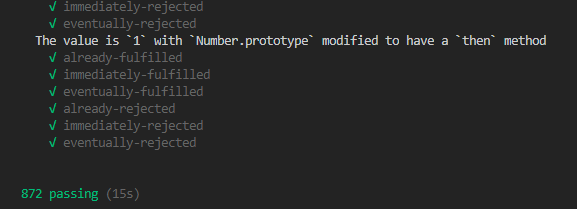

# DIY-Promise

### 自己动手实现一个符合 Promise A+ 规范的 Promise

#### 1. 什么是 Promise

> Promise 是 JS 异步编程中的重要概念，异步抽象处理对象，是目前比较流行 Javascript 异步编程解决方案之一。

- [阮一峰 Promise 教程](http://es6.ruanyifeng.com/#docs/promise)

#### 2. 用途

> 避免回调地狱，优雅的异步编程方案

#### 3. 功能

- [x] Promise.prototype.then()
- [x] Promise.prototype.catch()
- [x] Promise.prototype.finally()
- [x] Promise.resolve
- [x] Promise.reject
- [x] Promise.all
- [x] Promise.race
- [x] Promise.allSettled

#### 4. 测试

```
npm run test
```

##### 测试用例结果:



- [Promise A+ 规范测试用例](https://github.com/promises-aplus/promises-tests)

### 参考

- [Promise A+ 规范【英文】](https://promisesaplus.com/)
- [Promise A+ 规范【中文】](https://malcolmyu.github.io/2015/06/12/Promises-A-Plus/)
